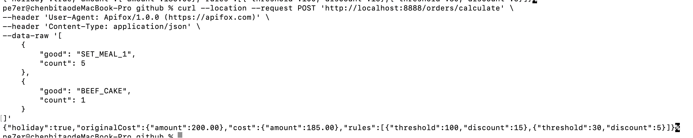
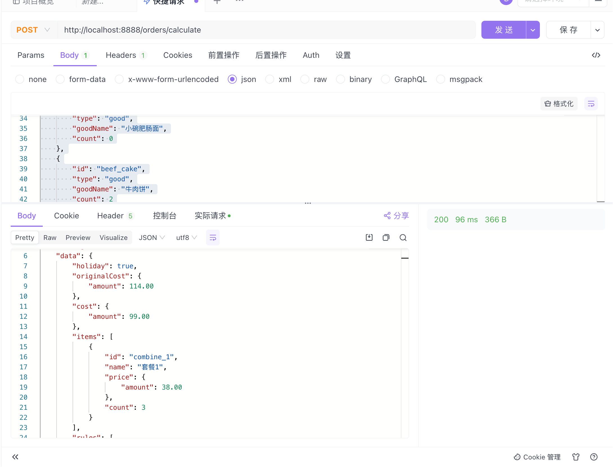

# 牛肉面算账系统

[](https://deepwiki.com/cbtpro/noodle_shop)

一个基于 Spring Boot 的牛肉面店订单计算系统，支持商品管理、套餐组合、折扣计算等功能。

## 系统特性

- 智能套餐匹配: 自动将单品组合成最优惠的套餐,支持配置开启、关闭
- 节假日折扣: 支持满减优惠规则，支持特价商品可排除在折扣外
- 商品分类管理: 支持普通商品和套餐商品两种类型
- 精确金额计算: 使用 BigDecimal 避免浮点数精度问题

## 环境要求

- Java 17+
- Maven 3.6+
- Spring Boot 3.x

## 快速开始

### 运行应用

```bash
mvn spring-boot:run
```

应用将在 `http://localhost:8888` 启动。

### 单元测试

```bash
mvn test
```

## 商品目录

### 商品

支持新增、修改品类

- 大碗牛肉面 (¥18) - `beef_noodle_large`
- 中碗牛肉面 (¥16) - `beef_noodle_medium`  
- 小碗牛肉面 (¥14) - `beef_noodle_small`
- 大碗肥肠面 (¥20) - `intestine_noodle_large`
- 中碗肥肠面 (¥18) - `intestine_noodle_medium`
- 小碗肥肠面 (¥16) - `intestine_noodle_small`
- 牛肉饼 (¥10) - `beef_cake`
- 奶茶 (¥12) - `milk_tea`

### 套餐

支持新增、修改套餐

- 套餐1 (¥38) - `combine_1`: 大碗牛肉面 + 牛肉饼 + 奶茶 (节省¥2)
- 套餐2 (¥40) - `combine_2`: 大碗肥肠面 + 牛肉饼 + 奶茶 (节省¥2)

## API 接口

### 订单计算接口

**接口地址**: `POST /orders/calculate`

**请求格式**:

```json
[
    {
        "code": "商品code",
        "type": "商品类型(good/combine)", 
        "goodName": "商品名称",
        "count": "数量"
    }
]
```

**响应格式**:
```json
{
    "code": 200,
    "message": "success", 
    "data": {
        "originalCost": "原价",
        "finalCost": "最终价格",
        "discount": "折扣金额",
        "items": "订单明细"
    }
}
```

### 接口测试示例

```bash
curl --location --request POST 'http://localhost:8888/orders/calculate' \
--header 'User-Agent: Apifox/1.0.0 (https://apifox.com)' \
--header 'Content-Type: application/json' \
--data-raw '[
    {
        "code": "beef_noodle_large",
        "type": "good",
        "goodName": "大碗牛肉面",
        "count": 2
    },
    {
        "code": "beef_noodle_medium",
        "type": "good",
        "goodName": "中碗牛肉面",
        "count": 0
    },
    {
        "code": "beef_noodle_small",
        "type": "good",
        "goodName": "小碗牛肉面",
        "count": 0
    },
    {
        "code": "intestine_noodle_large",
        "type": "good",
        "goodName": "大碗肥肠面",
        "count": 0
    },
    {
        "code": "intestine_noodle_medium",
        "type": "good",
        "goodName": "中碗肥肠面",
        "count": 0
    },
    {
        "code": "intestine_noodle_small",
        "type": "good",
        "goodName": "小碗肥肠面",
        "count": 0
    },
    {
        "code": "beef_cake",
        "type": "good",
        "goodName": "牛肉饼",
        "count": 2
    },
    {
        "code": "milk_tea",
        "type": "good",
        "goodName": "奶茶",
        "count": 2
    },
    {
        "code": "combine_1",
        "type": "combine",
        "goodName": "套餐1",
        "count": 1
    },
    {
        "code": "combine_2",
        "type": "combine",
        "goodName": "套餐2",
        "count": 0
    }
]'
```

## 业务规则

### 套餐自动匹配
系统会自动检测订单中的商品组合，将符合套餐条件的商品自动组合成套餐以获得最优价格。

### 折扣规则
- 满100元减15元
- 满30元减5元  
- 奶茶不参与折扣活动
- 仅在节假日生效

## 系统架构

### 核心组件
- OrderController: REST API 控制器
- OrderService: 订单业务逻辑服务
- BillingService: 计费服务接口
- ProductProperties: 商品配置管理

### 领域模型
- Order: 订单聚合根
- Goods: 商品实体
- Combine: 套餐实体

## 配置说明

主要配置位于 `src/main/resources/application.yml`

- 服务端口: 8888
- 自动套餐组合: 默认开启
- 商品目录: 在配置文件中维护
- 不参与折扣商品: 可配置排除列表

## 开发说明

本项目采用领域驱动设计(DDD)架构，使用 Spring Boot 框架开发。商品信息暂时配置在 YAML 文件中，生产环境建议迁移到数据库。

### 测试用例
项目包含完整的单元测试，覆盖各种业务场景: 

- 基础订单计算
- 折扣规则验证  
- 套餐匹配逻辑
- 边界条件测试

## 截图




## TODO

- 数据库支持
- 404重定向
